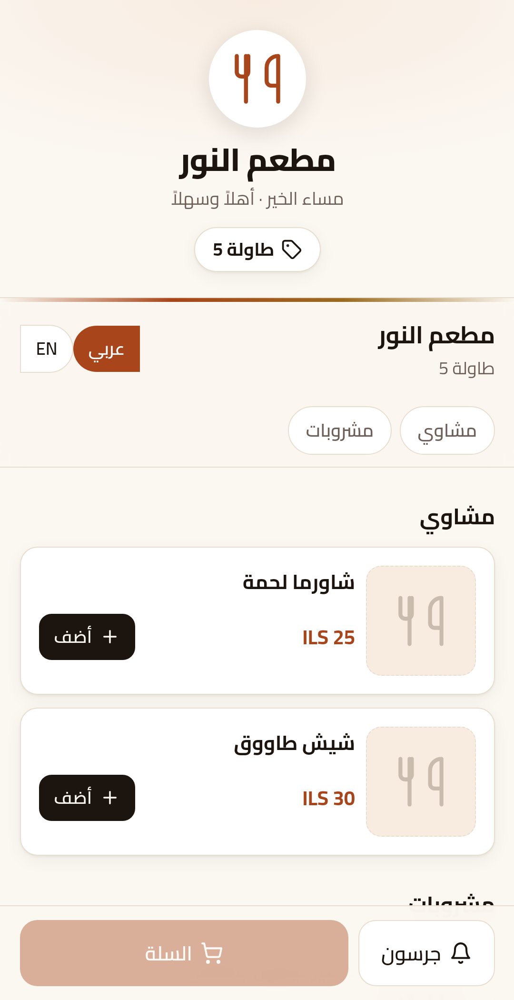
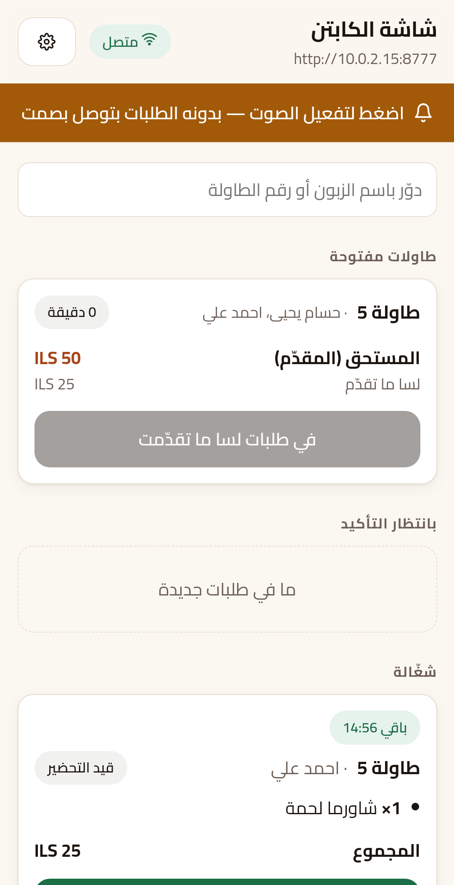
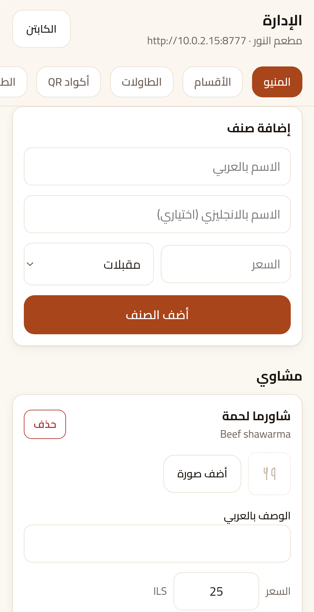
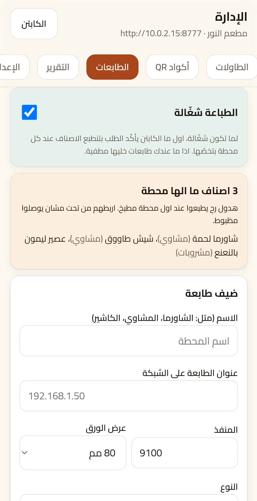
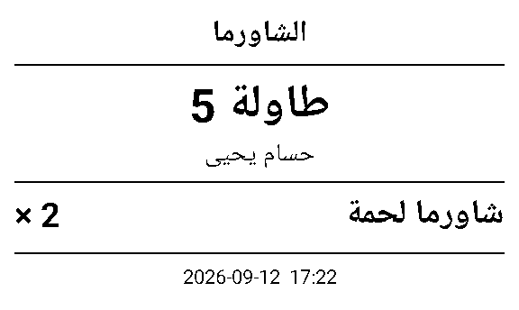
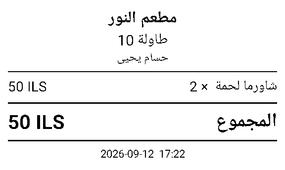

# QR Menu & Table Ordering — runs on the restaurant's own phone

A complete QR menu and table-ordering system for restaurants and cafés that
needs **no server, no hosting, no subscription and no internet**. The whole
thing — menu, ordering, the captain's screen, kitchen printing, the till bill
— runs inside one Android app on a phone sitting in the restaurant.

**[See the screens →](https://eprahem-yhya.github.io/qr-menu-showcase/)**

> This repository is a showcase. It contains screenshots and a description,
> not the source code. To buy the app, see [Buying it](#buying-it) below.

---

## What it does

A guest sits down, scans the QR code stuck to the table, and the menu opens
in their browser — no app to install, no sign-up. They choose, give a name,
and send the order. It appears on the captain's phone, he confirms it, and it
prints at the right station: grills to the grill, drinks to the bar. When the
table is done, the bill prints at the till.

Everything happens over the restaurant's own WiFi. The phone *is* the server.

## Why it is built this way

Most systems of this kind are websites. They need hosting, a domain, a
monthly fee, and a working internet connection — and when any of those stop,
the restaurant stops taking orders.

This one was built for places where that is not a safe assumption. It keeps
working through an internet outage, costs nothing per month, and depends on
nobody: the restaurant owns the phone, the data and the app.

## What's included

**For the guest**
- Menu with sections, photos, prices, and Arabic/English
- Order from the table, and add to an order already open
- See the order's progress — being prepared, ready
- Call a waiter with one button

**For the captain**
- Live order screen with a sound alert and a connection indicator
- Confirm or reject each order before the kitchen sees it
- A countdown per order, so a late table shows before the guest asks
- Waiter calls, table bills, and settling a table

**For the owner**
- Menu management: items, sections, prices, photos, availability
- Tables and printable QR cards (PDF, one per table)
- Multiple print stations — grill, bar, till — each getting only its own lines
- The day's report, reconciled against the cash drawer
- Backup and restore in one file
- WiFi card for guests, printable

**Under the hood**
- Arabic throughout, properly shaped on screen and on thermal paper
- Money handled in whole minor units, so totals reconcile exactly
- Admin screens reachable only from the phone itself, checked at the socket
- Activation locked per device
- Over ninety automated tests on a real Android device, including one that
  plays a whole evening through and checks the night's takings

## What it needs

- One Android phone (Android 7 or newer) that stays on a charger
- The restaurant's WiFi
- Optionally, one or more ESC/POS thermal printers on that WiFi

No computer. No internet. No monthly bill.

## Screens

| | |
|---|---|
|  |  |
| The guest's menu | The captain's screen |
|  |  |
| Menu management | Print stations |

Kitchen ticket and till bill, on 80mm thermal paper:

## Buying it

The app is sold as a finished product, installed and activated for your
restaurant. Get in touch and I'll walk you through it:

**WhatsApp: [+972 59 880 5952](https://wa.me/972598805952)**

Please say which restaurant it is for and how many tables, and I'll tell you
what it costs and how quickly it can be running.

---

*Screenshots are of the real app, captured during automated testing on an
Android device.*
